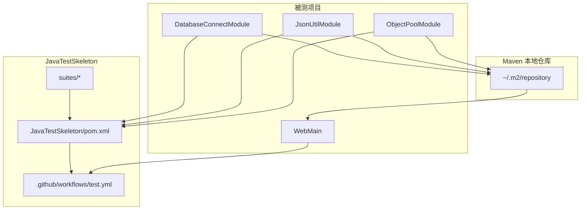

# Architecture.md

## 1. 总体架构



## 2. 两类验证路径

### 2.1 共享模块源码直测

适用项目：

- `DatabaseConnectModule`
- `JsonUtilModule`
- `ObjectPoolModule`

实现方式：

- 通过 `build-helper-maven-plugin` 按 profile 把单个被测项目源码加入编译路径
- 测试代码放在 `JavaTestSkeleton/suites/<project>/`
- `verify` 阶段统一执行：
  - Surefire / Failsafe
  - JaCoCo
  - SpotBugs
  - PMD
  - Dependency Check

### 2.2 WebMain artifact 集成验证

适用项目：

- `WebMain`

实现方式：

1. 先对 `DatabaseConnectModule`、`JsonUtilModule`、`ObjectPoolModule` 执行 `clean install -DskipTests`
2. 将构建好的 artifact 安装到本地 Maven 仓库
3. 直接运行 `projects/WebMain/hivehbase/pom.xml` 自带测试

这个路径的目标是确保 `WebMain` 只依赖 peer artifact，而不是直接引用 peer 项目源码。

## 3. CI 矩阵

`test.yml` 中每个 job 只负责一个被测项目：

```text
DatabaseConnectModule -> clean verify
JsonUtilModule        -> clean verify
ObjectPoolModule      -> clean verify
WebMain               -> install peer artifacts -> clean test
```

这样每个被测项目都有独立结果、独立报告和独立发布触发。

## 4. 关键设计决策

1. **被测项目保持平级**  
   JavaTestSkeleton 只负责测试，不把一个被测项目变成另一个被测项目的源码依赖。

2. **WebMain 走 artifact 边界**  
   `WebMain` 依赖共享模块时，验证路径必须模拟真实 Maven 消费方式。

3. **profile 隔离测试输入**  
   每个 profile 只引入一个共享模块源码，避免原先“多项目混测”的污染。

4. **测试 JVM 与静态分析限内存运行**  
   为了在受限环境下稳定执行，Surefire / Failsafe / SpotBugs 都限制了 JVM 内存参数。
